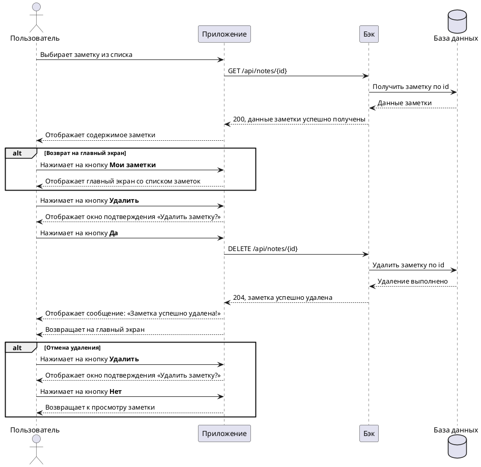

# Диаграмма последовательности «Удаление заметки»

```puml
@startuml

actor Пользователь as U
participant Приложение as FE
participant Бэк as BE
database "База данных" as DB

U -> FE: Выбирает заметку из списка
FE -> BE: GET /api/notes/{id}
BE -> DB: Получить заметку по id
BE <-- DB: Данные заметки
FE <-- BE: 200, данные заметки успешно получены
U <-- FE: Отображает содержимое заметки

alt Возврат на главный экран
U -> FE: Нажимает на кнопку **Мои заметки**
U <-- FE: Отображает главный экран со списком заметок
end alt

U -> FE: Нажимает на кнопку **Удалить**
U <-- FE: Отображает окно подтверждения «Удалить заметку?»
U -> FE: Нажимает на кнопку **Да**
FE -> BE: DELETE /api/notes/{id}
BE -> DB: Удалить заметку по id
BE <-- DB: Удаление выполнено
FE <-- BE: 204, заметка успешно удалена
U <-- FE: Отображает сообщение: «Заметка успешно удалена!»
U <-- FE: Возвращает на главный экран

alt Отмена удаления
U -> FE: Нажимает на кнопку **Удалить**
U <-- FE: Отображает окно подтверждения «Удалить заметку?»
U -> FE: Нажимает на кнопку **Нет**
U <-- FE: Возвращает к просмотру заметки
end alt

@enduml
```