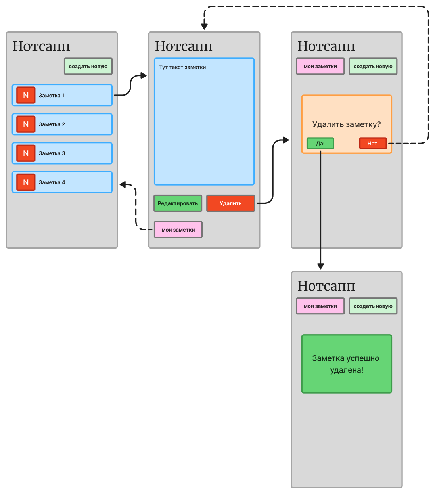

# Пользовательский сценарий «Удаление заметки»

## Действующие лица
1. Пользователь
2. Система

## Предварительные условия

1. Пользователь находится на главном экране со списком заметок.
2. У пользователя есть хотя бы одна заметка.

## Выходные условия

1. Заметка удалена из системы.
2. Заметка не отображается на главном экране.

## Основной сценарий
1. Пользователь выбирает заметку из списка.
2. Система отображает содержимое выбранной заметки.
3. Пользователь нажимает на кнопку **Удалить**.
4. Система отображает окно подтверждения удаления заметки с вопросом: «Удалить заметку?».
5. Пользователь нажимает на кнопку **Да**.
6. Система удаляет заметку.
7. Система отображает сообщение: «Заметка успешно удалена!».
8. Система возвращает пользователя на главный экран. Удаленная заметка не отображается на главном экране.

## Альтернативные сценарии

### АС 1. Пользователь возвращается на главный экран

1. Пользователь выбирает заметку из списка.
2. Система отображает содержимое выбранной заметки.
3. Пользователь нажимает на кнопку **Мои заметки**.
4. Система возвращает пользователя на главный экран.

### АC 2. Пользователь отменяет удаление
1. Пользователь выбирает заметку из списка.
2. Система отображает содержимое выбранной заметки.
3. Пользователь нажимает на кнопку **Удалить**.
4. Система отображает окно подтверждения удаления заметки с вопросом: «Удалить заметку?».
5. Пользователь нажимает на кнопку **Нет**.
6. Система закрывает окно подтверждения удаления заметки.
7. Система возвращает пользователя к просмотру содержимого заметки.

## Схема пользовательского сценария «Удаление заметки»

!!! info "Справка"
    Схема приведена из [спецификации приложения Нотсапп](./specification.md).
    На схеме сплошные стрелки обозначают основной сценарий, пунктирные — альтернативные сценарии.
